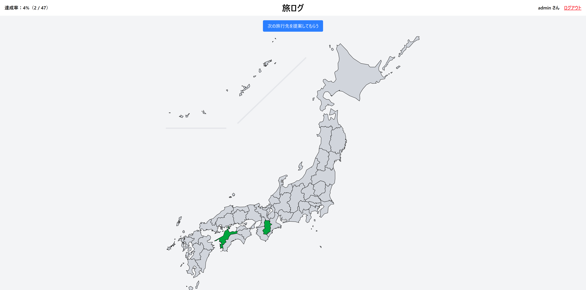

# 旅ログ

旅行の思い出を記録し、他のユーザと共有できる旅行記録アプリです。
さらに、過去の日記や他ユーザの投稿内容をもとに、AIが次の旅行先を提案します。

---

## デモ

トップ画面


### ライブデモ
[こちらで実際に試せます](https://travelog-lake.vercel.app/)


---

## 概要

- **アプリ名**：旅ログ
- **目的**：

  - 個人の旅行の思い出を記録する
  - 他ユーザと旅行体験を共有する
  - AIを活用して次の旅行先を提案する
- **解決したい課題**：

  - 旅行先がなかなか決まらない
- **ターゲットユーザ**：

  - 旅行初心者〜旅行上級者まで、旅行が好きなすべての人

詳細な仕様は[こちら](./spec.md)

---

## 対応環境

- **プラットフォーム**：Webアプリ
- **対応端末**

  - PC
  - タブレット
  - スマートフォン

---

## 技術スタック

<!-- | 分野      | 使用技術              |
| ------- | ----------------- |
| フロントエンド | Next.js           |
| バックエンド  | Next.js           |
| データベース  | Supabase          |
| 生成AI    | Google Gemini API | -->
<!-- | 認証      | Supabase Auth（想定） | -->


---

## 主な機能

## 認証機能

### ログイン

- ユーザIDとパスワードでログイン
- 認証成功時にTOPページへ遷移
- 認証失敗時はエラーメッセージ表示
- パスワードはハッシュ化して照合

### 新規登録

- ユーザID / パスワード登録
- 既存ユーザIDは登録不可
- 登録完了後ログインページへ遷移

---

## TOPページ

- 日本地図を表示
- 投稿済み都道府県は色分け表示
- ホバー時に色変化
- 地図クリックで都道府県ページへ遷移
- AIによる次の旅行先提案
- ログアウト機能

---

## 各都道府県ページ

- 全ユーザの旅行日記を閲覧可能
- TOPページへ戻るボタンあり

### 投稿内容

- ユーザID
- 訪れた場所
- 日付
- 本文（任意）
- おすすめ度（★1〜5）
- 雰囲気（静か〜賑やか）
- 費用（任意）

### 自分の投稿に対して可能な操作

- 新規投稿
- 編集
- 削除

---

## AI旅行先提案機能

Google Gemini API を利用し、以下の情報をもとに次の旅行先を提案します。

- 自分の過去投稿
<!-- - 他ユーザの投稿傾向 -->
- 好み（雰囲気 / 費用 / 地域 など）
- カスタムプロンプト入力

---

## セキュリティ・追加対応

- 未ログイン状態でTOPページへ直接アクセス不可
- パスワードハッシュ化保存
- 認証制御
<!-- - 各種セキュリティ対策実施 -->

---

## データベース設計

## user テーブル

| カラム名   | 型    | 内容         |
| ------ | ---- | ---------- |
| userId | uuid | 主キー        |
| pwd    | text | ハッシュ化パスワード |

---

## posts テーブル

| カラム名           | 型         | 内容         |
| -------------- | --------- | ---------- |
| id             | uuid      | 主キー        |
| userId         | uuid      | 投稿者ID      |
| prefName       | text      | 都道府県名      |
| date           | timestamp | 訪問日        |
| placeName      | text      | 場所名        |
| content        | text      | 本文         |
| recommendation | int       | おすすめ度（1〜5） |
| atmosphere     | int       | 雰囲気        |
| expenses       | int       | 費用         |
| isPrivate      | boolean   | 非公開設定      |
| createdAt      | timestamp | 作成日時       |
| updatedAt      | timestamp | 更新日時       |

---

## UI / UX 方針

- シンプル
- モダン
- 直感的な操作性
- スマホでも見やすいレスポンシブ設計

---

## 改善済みポイント

- レンダリング速度改善
- ページ遷移数削減
- カスタムプロンプト機能追加
- AIレスポンスのストリーム表示対応
- ホバー時カーソルUI改善

---

## 今後の拡張案

- パスワード再設定機能
- 投稿削除・編集機能
- 写真投稿機能
- 旅行ルート提案
- フォロー / いいね / タグ機能
- 地域別ランキング
- 海外旅行対応
- SNS共有機能
- 他ユーザの投稿傾向のプロンプト組み込み

---

## 開発目的

旅行の思い出を記録するだけでなく、
「次はどこへ行こう？」という悩みまで解決できるサービスを目指しています。

---

## ディレクトリ / ファイル構成

```bash
travelog/
├── public/
├── src/
├── README.md
├── eslint.config.mjs
├── next.config.ts
├── package-lock.json
├── package.json
├── postcss.config.mjs
├── spec.md
└── tsconfig.json
```

### 説明

| ディレクトリ / ファイル   | 説明                     |
| --------------- | ---------------------- |
| `src/`          | アプリ本体のソースコード           |
| `public/`       | 画像・アイコンなどの静的ファイル       |
| `.next/`        | Next.js ビルド生成物         |
| `node_modules/` | 依存ライブラリ                |
| `spec.md`       | 要件定義・仕様書               |
| `README.md`     | プロジェクト説明               |
| `package.json`  | パッケージ管理・スクリプト定義        |
